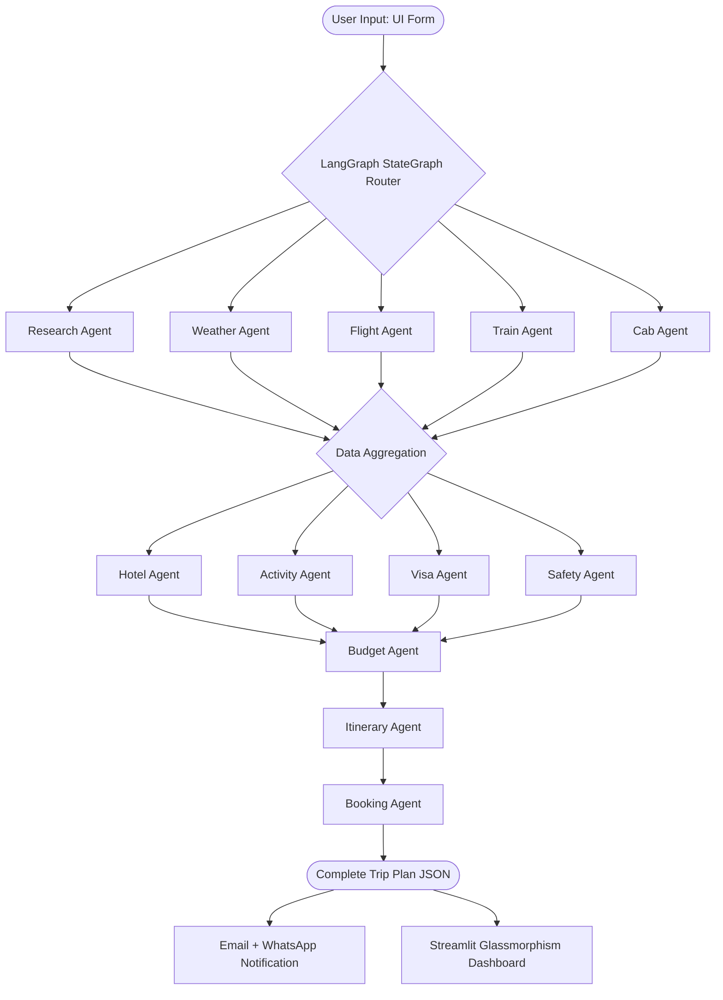

<div align="center">
  
# 🌍 AI Autonomous Travel Planner
### Multi-Agent AI System powered by Groq, LangGraph, and Streamlit

> **Plan your dream vacation end-to-end in under 2 minutes.** <br>
> *An intelligent multi-agent system that replicates the entire workflow of a premium travel agency using LLMs, Browser Automation, and Real-Time APIs.*

</div>

<br>

---

## ❗ The Problem with Modern Travel Planning

Planning a trip today is fundamentally **broken**. The modern internet has fragmented travel planning into dozens of disjointed platforms:

| Pain Point | The Reality |
|---|---|
| 🕐 **Time-consuming** | Travellers switch between 10+ tabs — Google Flights, Booking.com, TripAdvisor, Visa portals, weather apps, currency converters, and local transport sites. The average traveller spends **8–12 hours** researching before booking. |
| 💸 **Expensive Intermediaries** | Travel agents charge 10–20% commission on bookings. Premium bespoke trip planners cost ₹2,000–₹10,000 per plan. |
| 🤯 **Decision Fatigue** | Thousands of options for flights, hotels, and activities with no single place to compare, contextualize, and decide based on your specific budget and constraints. |
| 📋 **Lack of Personalisation** | Generic tour packages treat every tourist the same, ignoring specific budgets, niche interests, travel style, and nationality constraints. |
| 🚫 **Missing Critical Info** | Independent travellers often forget to check vital details: visa requirements, safety advisories, local emergency numbers, and vaccination needs until the last minute. |
| 📵 **No Post-Plan Support** | Once you have a plan, you still have to manually track flights, contact airlines, hotels, and figure out local transport on the ground. |

---

## ✅ What We Built

The **AI Autonomous Travel Planner** is an advanced **13-agent AI orchestration system** that automatically researches, plans, and delivers a complete travel itinerary. It does the work of 12 specialists concurrently.

**The Workflow is Simple:**
You enter: **Destination + Origin + Dates + Budget + Interests**

The system spins up **13 specialized AI agents** in parallel using `LangGraph`, each acting as a domain expert:



---

## 🤖 The 13 Specialized Agents

This system employs a Functional Paradigm via LangChain's `create_agent` and `@tool` to manage state efficiently.

| # | Agent Name | Core Tooling | What It Does |
|---|------------|--------------|--------------|
| 1 | 🔍 **ResearchAgent** | `search_web`, `search_knowledge_base`, `store_in_knowledge_base` | Scrapes the web for destination guides, tips, hidden gems, and local culture. Uses ChromaDB to store/retrieve RAG knowledge to prevent redundant web scraping. |
| 2 | 🌤️ **WeatherAgent** | `fetch_weather` | Connects to OpenWeatherMap for live 5-day forecasts, returning granular data, packing lists, and clothing recommendations. |
| 3 | ✈️ **FlightAgent** | `search_web` | Searches real-time flight data (aggregating sources like Google Flights/Skyscanner/Kayak) to extract optimal routes, durations, and pricing. |
| 4 | 🚂 **TrainAgent** | `search_web` | Finds rail options (IRCTC for India, Eurail for EU, Amtrak for US) with class-wise pricing and timetables. |
| 5 | 🚖 **CabAgent** | `search_web` | Estimates local transport costs (Uber, Ola, Grab) including airport transfers and intercity cab fares. |
| 6 | 🏨 **HotelAgent** | `search_web` | Curates budget, mid-range, and luxury accommodation picks, parsing distances to city centers and guest ratings. |
| 7 | 🎯 **ActivityAgent** | `search_web` | Categorizes activities by user interests: adventure, culture, food, family, and nightlife. Includes duration and pricing. |
| 8 | 📋 **VisaAgent** | `search_web` | Checks current official visa policies based on origin/destination nationality, pulling fees, processing times, and required documents. |
| 9 | 🛡️ **SafetyAgent** | `search_web` | Analyzes travel advisories, emergency numbers, scam alerts, health/vaccination requirements, and safe neighborhoods. |
| 10 | 💰 **BudgetAgent** | *(No tools, pure synthesis)* | Synthesizes all gathered data, calculates full cost breakdown, adds a 10% buffer, and flags if the trip is within budget or over budget. |
| 11 | 📅 **ItineraryAgent**| `search_knowledge_base` | Reads the research RAG DB and constructs a coherent, geographically-logical day-by-day itinerary separated into morning/afternoon/evening slots. |
| 12 | 📱 **BookingAgent** | `search_web` | Generates direct booking links, step-by-step instructions, and cancellation advice for flights, hotels, and trains. |
| 13 | 📡 **TrackingAgent** | `track_flight_status`, `track_train_status` | **Live Tracking!** Acts as a post-booking assistant. You provide an IATA flight number (e.g., `AI202`) and it returns live gate info, delays, and airborne coordinates. |

---

## 🛠️ Comprehensive Tech Stack

| Layer | Technology Used | Description |
|-------|----------------|-------------|
| **Frontend/UI** | [Streamlit](https://streamlit.io) | Custom CSS injected for a premium Dark Glassmorphism aesthetic. |
| **LLM Engine** | [Groq](https://groq.com) | Uses `llama-3.3-70b-versatile` for ultra-fast, low-latency reasoning and JSON generation. |
| **Agent Framework** | [LangChain](https://langchain.com) | Core agent generation via canonical `create_agent` and `@tool` wrappers. |
| **Orchestration** | [LangGraph](https://langchain-ai.github.io/langgraph) | Manages the `StateGraph` and controls parallel execution, error recovery, and data passing between the 12 primary agents. |
| **Web Search Automation** | [Playwright MCP](https://playwright.dev) | Model Context Protocol (`@playwright/mcp`) running on Node.js to spin up headless browsers and scrape live booking sites. Falls back to `ddgs` (DuckDuckGo Search) if MCP fails. |
| **RAG / Memory** | [ChromaDB](https://www.trychroma.com) | Persistent local vector store powered by `all-MiniLM-L6-v2` embeddings to cache destination research across different runs. |
| **Data APIs** | OpenWeatherMap | Real-time weather data and 5-day predictive forecasts. |
| **Data APIs** | ExchangeRate API | Live foreign exchange rates for dynamic budget calculation. |
| **Notifications** | Twilio & SMTP | Pushes the final itinerary via WhatsApp (Twilio API) and Email (smtplib). |

---

## 🎨 UI/UX: The Glassmorphism Experience

We didn't just build a smart backend; we built a frontend that looks like a $10M SaaS product.
- **Dynamic CSS Integration:** Deeply customized Streamlit UI with CSS overrides.
- **Gradient Themes:** Deep space gradients (`#0f0c29` to `#0f3460`) with neon blue and green accents.
- **Glass Cards:** Semi-transparent frosted glass panels (`backdrop-filter: blur(20px)`) that elevate data presentation.
- **Micro-animations:** Hover effects, pulsing active agent states (`animation: pulse-glow`), and smooth transitions.
- **Smart Data Rendering:** Complex JSON output from agents is flattened into clean, responsive grid layouts with custom metrics and safety badges.

---

## ⚡ Setup & Installation Guide

Follow these steps to run the AI Autonomous Travel Planner locally on your machine.

### Prerequisites
- Python 3.9+
- Node.js (v18+) & npm (required for the Playwright MCP server)
- A modern browser

### 1. Clone & Environment Setup
```bash
git clone <repository_url>
cd "AI Autonomous Travel Planner"

# Create a virtual environment
python -m venv venv
source venv/bin/activate  # On Windows use: venv\Scripts\activate

# Install Python dependencies
pip install -r requirements.txt

# Install Playwright browser binaries
playwright install
```

### 2. Install Browser MCP Dependencies
The system uses the Model Context Protocol (MCP) to let the LLM securely control a headless browser.
```bash
npm install
```

### 3. Environment Variables Configuration
Copy the sample environment file and add your API keys:
```bash
cp .env.example .env
```
Edit `.env` with your preferred editor. You will need:
- `GROQ_API_KEY`: Get it from [console.groq.com](https://console.groq.com)
- `OPENWEATHER_API_KEY`: Get it from [openweathermap.org](https://openweathermap.org/api)
- `EXCHANGERATE_API_KEY`: Get it from [exchangerate-api.com](https://www.exchangerate-api.com)
- `TWILIO_ACCOUNT_SID`, `TWILIO_AUTH_TOKEN`, `TWILIO_WHATSAPP_NUMBER`: Get it from [Twilio](https://twilio.com)
- `EMAIL_ADDRESS`, `EMAIL_PASSWORD`: For sending email itineraries (Use an App Password if using Gmail).

### 4. Running the Application
The application requires two processes running simultaneously: the MCP server and the Streamlit app.

**Terminal 1 (Start the MCP Server):**
```bash
npm run mcp
```

**Terminal 2 (Start the Streamlit UI):**
```bash
source venv/bin/activate
streamlit run main.py
```

> **Access the App** → Go to `http://localhost:8501` in your browser.

---

## 🏎️ Smart Caching & Performance

To prevent burning API credits and waiting for repetitive LLM generations, we built a **Smart Caching System**:
- **MD5 Hash Keys:** When a user submits a query, we generate an MD5 hash of their parameters (`destination`, `origin`, `dates`, `budget`, `interests`).
- **Disk Persistence:** If a matching JSON payload is found in the `trip_cache/` directory, the UI loads the comprehensive trip plan **instantly** (in ~50ms).
- **RAG Chroma DB:** Even if a query isn't an exact cache hit, the `ResearchAgent` pulls previous destination insights from the local ChromaDB `travel_knowledge` collection, vastly speeding up the generation process.

---

## 💼 Business Value & Market Opportunity

### The Profit Model
| Metric | Traditional Travel Agency | AI Travel Planner |
|--------|--------------------------|-------------------|
| ⏱️ **Time to Delivery** | 2-3 Business Days | **< 2 Minutes** |
| 💸 **Cost to Customer** | ₹2,000–₹10,000 fee | **Free / SaaS Model** |
| 🌐 **Sources Checked** | Human checks 3-4 sites | **Agent scrapes 10+ sites concurrently** |
| 📋 **Output Scope** | Flights + Hotels | **12 Categories (Visas, Safety, Transport, etc)** |
| 🚨 **Risk Management** | Often missed by humans | **Mandatory Safety & Visa Agents** |

### Potential Revenue Streams
1. **B2C SaaS Subscription:** ₹499/month for unlimited premium planning, live tracking, and instant alerts.
2. **Affiliate Commissions:** Deep-linking booked flights and hotels via affiliate URLs, capturing 2-8% of the massive transaction volume.
3. **B2B API Licensing:** White-labeling this multi-agent engine to OTAs (Online Travel Agencies) or credit card concierge services.

---

## 📂 Project Structure Directory

```text
AI Autonomous Travel Planner/
├── main.py                # Main Streamlit UI & Frontend execution logic
├── workflow.py            # LangGraph StateGraph orchestrator & state definitions
├── agents.py              # The 13 LangChain Agents, LLM config, and @tools
├── tracking.py            # Logic for live flight/train tracking APIs
├── mcp_client.py          # Node.js MCP integration (Browser automation)
├── config.py              # Environment variable loading & validation
├── notifications.py       # Twilio WhatsApp & SMTP Email delivery logic
├── utils.py               # Helper functions: currency, date validation, JSON parsing
├── config.json            # MCP server configuration
├── package.json           # Node dependencies for Playwright MCP
├── requirements.txt       # Python library dependencies
├── README.md              # Project documentation
├── .gitignore             # Git ignore file
└── .env                   # Secret keys (Do not commit)
```

---

## 🔮 Future Roadmap

- [ ] **Multi-City Itineraries:** Extend the LangGraph router to handle complex multi-leg Euro-trips and global backpacking routes.
- [ ] **OAuth Integrations:** Connect directly to Google Calendar APIs to auto-populate the user's calendar with the day-by-day itinerary.
- [ ] **Real-Time Price Drop Alerts:** Background CRON jobs that run the Flight Agent daily and WhatsApp the user if a flight to their dream destination drops in price.
- [ ] **Collaborative Planning:** Enable multiplayer mode where multiple users can vote on activities and hotels generated by the agents.
- [ ] **Voice Interface:** Integrate with OpenAI Whisper / Groq Audio to allow users to plan their trips entirely via voice commands.

---

## 📜 License

This project is licensed under the MIT License - see the LICENSE file for details.

---

<div align="center">
  <b>Built by Harsh Singh · AI Autonomous Travel Planner · 2026</b><br>
  <i>Pushing the boundaries of autonomous multi-agent systems.</i>
</div>
